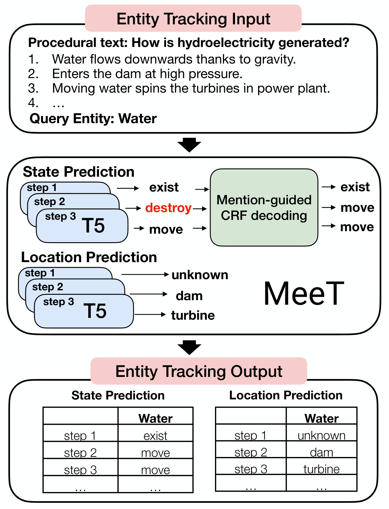

# MeeT



This repo contains codes for the following paper:

Janvijay Singh, Fan Bai, Zhen Wang: [Entity Tracking via Effective Use of Multi-Task Learning Model and Mention-guided Decoding](https://arxiv.org/pdf/2210.06444.pdf), EACL 2023

# ProPara Dataset

We used the official dataset [split](https://docs.google.com/spreadsheets/d/1x5Ct8EmQs2hVKOYX7b2nS0AOoQi4iM7H9d9isXRDwgM/edit#gid=506891632) and evaluation [script](https://github.com/allenai/aristo-leaderboard/tree/master/propara).

## Train + Inference using MeeT

```
# clean the existing logs and saved predictions
rm -rf logs/propara/train/state/*
rm -rf logs/propara/train/location/*

# setup a virtual environment - make sure to have exact versions of packages to ensure reproducibility
python3 -m venv ../meet_venv
source ../meet_venv/bin/activate
pip install -r requirements.txt

# train MeeT for state and location question
python code/propara/train/state.py --batch_size 16 --learning_rate 1e-4 --epochs 5 --tokeniser t5-large --lm_model t5-large --output_dir ./logs/propara/train/state;
python code/propara/train/location.py --batch_size 16 --learning_rate 1e-4 --epochs 5 --tokeniser t5-large --lm_model t5-large --output_dir ./logs/propara/train/location;

# CRF based post-processing and evaluation
./eval/propara/merged_state_location_eval.sh logs/propara/train/state logs/propara/train/location;
```

Note that hyper-parameter selection, including the random seed, can have an impact on the model's performance. This could be due to the small size of the dev and test sets of ProPara and the domain gap between them. To mitigate this issue, we recommend using early stopping during training.

## Inference using MeeT
We release our pre-trained checkpoints in this [Google Drive](https://drive.google.com/drive/folders/1lk82H1z2zjclE8ef9GHj95ABhxvIcmrc?usp=sharing). For inference only mode, download the state and location checkpoints and place them in respectively at `logs/propara/inference/state/ckpts` and `logs/propara/inference/location/ckpts` for state and location checkpoints respectively. 

Ensure that the path to placed checkpoints should be `logs/propara/inference/state/ckpts/best.ckpt` and `logs/propara/inference/location/ckpts/best.ckpt`.

```
# clean the existing logs and saved predictions
rm -rf logs/propara/inference/state/*
rm -rf logs/propara/inference/location/*

# setup a virtual environment - make sure to have exact versions of packages to ensure reproducibility
python3 -m venv ../meet_venv;
source ../meet_venv/bin/activate;
pip install -r requirements.txt;

# inference using MeeT for state and location questions using pre-trained checkpoints
python code/propara/inference/state.py --batch_size 16 --tokeniser t5-large --lm_model logs/propara/inference/state/ckpts/best.ckpt --output_dir ./logs/propara/inference/state;
python code/propara/inference/location.py --batch_size 16 --tokeniser t5-large --lm_model logs/propara/inference/location/ckpts/best.ckpt --output_dir ./logs/propara/inference/location;

# CRF based post-processing and evaluation
./eval/propara/merged_state_location_eval.sh logs/propara/inference/state logs/propara/inference/location;
```

## Reproduced Results
```
Best dev results:
=================================================
Question     Avg. Precision  Avg. Recall  Avg. F1
-------------------------------------------------
Inputs                0.859        0.837    0.848
Outputs               0.771        0.957    0.854
Conversions           0.697        0.588    0.638
Moves                 0.764        0.462    0.576
-------------------------------------------------
Overall Precision 0.773                          
Overall Recall    0.711                          
Overall F1        0.741                          
=================================================

Evaluated 43 predictions against 43 answers.

Saved final dev predictions at: eval/propara/final_preds/dev_merged_state_and_location.tsv

Corresponding test results:
=================================================
Question     Avg. Precision  Avg. Recall  Avg. F1
-------------------------------------------------
Inputs                0.886        0.799    0.840
Outputs               0.829        0.892    0.859
Conversions           0.728        0.568    0.638
Moves                 0.769        0.424    0.547
-------------------------------------------------
Overall Precision 0.803                          
Overall Recall    0.671                          
Overall F1        0.731                          
=================================================

Evaluated 54 predictions against 54 answers.

Saved final test predictions at: eval/propara/final_preds/test_merged_state_and_location.tsv
```

# Recipes Dataset

We used the dataset split and evaluation scheme as used by past works such as [KoAlA](https://doi.org/10.1145/3442381.3450126) [LEMon](https://arxiv.org/pdf/2201.08081v3.pdf). The dataset [split](https://drive.google.com/drive/folders/1w6yuxeDtXXluH9bnNFFuHpRN6ci4Haz4) and evluation [scripts](https://drive.google.com/drive/folders/1PYGLe7hSoCYfpKmpPumeTy6jmPyONGz4) were provided by KoAlA authors.

## Train + Inference using MeeT

```
# clean the existing logs and saved predictions
rm -rf logs/recipes/train/state/*
rm -rf logs/recipes/train/location/*

# setup a virtual environment - make sure to have exact versions of packages to ensure reproducibility
python3 -m venv ../meet_venv
source ../meet_venv/bin/activate
pip install -r requirements.txt

# train MeeT for state and location question
python code/recipes/train/state.py --batch_size 8 --learning_rate 1e-4 --epochs 5 --tokeniser t5-large --lm_model t5-large --output_dir ./logs/recipes/train/state;
python code/recipes/train/location.py --batch_size 8 --learning_rate 1e-4 --epochs 5 --tokeniser t5-large --lm_model t5-large --output_dir ./logs/recipes/train/location;

# evaluation based on location-change
./eval/recipes/loc_change_eval.sh data/recipes/dev.json logs/recipes/train/state/dev_predictions_best.tsv logs/recipes/train/location/dev_predictions_best.tsv
./eval/recipes/loc_change_eval.sh data/recipes/test.json logs/recipes/train/state/test_predictions_best.tsv logs/recipes/train/location/test_predictions_best.tsv
```

## Inference using MeeT
We release our pre-trained checkpoints in this [Google Drive](https://drive.google.com/drive/folders/1lk82H1z2zjclE8ef9GHj95ABhxvIcmrc?usp=sharing). For inference only mode, download the state and location checkpoints and place them in respectively at `logs/recipes/inference/state/ckpts` and `logs/recipes/inference/location/ckpts` for state and location checkpoints respectively. 

Ensure that the path to placed checkpoints should be `logs/recipes/inference/state/ckpts/best.ckpt` and `logs/recipes/inference/location/ckpts/best.ckpt`.

```
# clean the existing logs and saved predictions
rm -rf logs/recipes/inference/state/*
rm -rf logs/recipes/inference/location/*

# setup a virtual environment - make sure to have exact versions of packages to ensure reproducibility
python3 -m venv ../meet_venv;
source ../meet_venv/bin/activate;
pip install -r requirements.txt;

# inference using MeeT for state and location questions using pre-trained checkpoints
python code/recipes/inference/state.py --batch_size 8 --tokeniser t5-large --lm_model logs/recipes/inference/state/ckpts/best.ckpt --output_dir ./logs/recipes/inference/state;
python code/recipes/inference/location.py --batch_size 8 --tokeniser t5-large --lm_model logs/recipes/inference/location/ckpts/best.ckpt --output_dir ./logs/recipes/inference/location;

# evaluation based on location-change
./eval/recipes/loc_change_eval.sh data/recipes/dev.json logs/recipes/inference/state/dev_predictions_best.tsv logs/recipes/inference/location/dev_predictions_best.tsv
./eval/recipes/loc_change_eval.sh data/recipes/test.json logs/recipes/inference/state/test_predictions_best.tsv logs/recipes/inference/location/test_predictions_best.tsv
```

## Reproduced Results
```
Best dev results:
Reading ground-truth from: data/recipes/dev.json
Reading state predictions from: logs/recipes/train/state/dev_predictions_best.tsv
Reading location predictions from: logs/recipes/train/location/dev_predictions_best.tsv
predicted location changes for 1#chicken: [{'step': 4, 'location': '?'}, {'step': 7, 'location': 'oven'}, {'step': 10, 'location': 'platter'}]
gold location changes for 1#chicken: [{'step': 4, 'location': '?'}, {'step': 7, 'location': 'broiler'}, {'step': 10, 'location': 'bowl'}]
756 instances evaluated.
Total predictions: 1332, total answers: 1268, total correct predictions: 907
Precision: 68.1, Recall: 71.5, F1: 69.8

Corresponding test results:
Reading ground-truth from: data/recipes/test.json
Reading state predictions from: logs/recipes/train/state/test_predictions_best.tsv
Reading location predictions from: logs/recipes/train/location/test_predictions_best.tsv
predicted location changes for 110#tea bags: [{'step': 2, 'location': '?'}, {'step': 4, 'location': 'jar'}]
gold location changes for 110#tea bags: [{'step': 2, 'location': '?'}, {'step': 4, 'location': 'jar'}]
737 instances evaluated.
Total predictions: 1355, total answers: 1280, total correct predictions: 870
Precision: 64.2, Recall: 68.0, F1: 66.0
```

## How to cite

If you extend or use this work, please cite the relevant papers:
```bibtex
@inproceedings{ProcTextMeeT,
    title = {Entity Tracking via Effective Use of Multi-Task Learning Model and Mention-guided Decoding},
    author = {Singh, Janvijay and Bai, Fan and Wang, Zhen},
    booktitle = "Proceedings of the 17th Conference of the European Chapter of the Association for Computational Linguistics: Main Volume",
    year = "2023",
    publisher = "Association for Computational Linguistics",
    url = "https://arxiv.org/abs/2210.06444",
}
```
